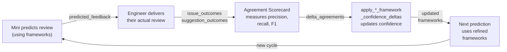

# Framework Confidence Loop

## What It Is

The framework-confidence loop is the compounding mechanism that makes Minis' decision-framework clones sharper and more reliable over time. Every prediction the mini makes is an hypothesis about the engineer's framework. Every interaction (review, artifact feedback, chat) generates ground-truth outcome data. That data flows back as deltas: confidence increases for frameworks that predicted well, decreases for those that missed.

The loop is: **predict framework** → **capture outcome** → **measure agreement** → **update confidence** → **next prediction uses higher-signal frameworks**.

This transforms Minis from a point-in-time snapshot to an adaptive system. The corpus compounds.

## The Loop



## Stages

### 1. Prediction: Review Planning
**File**: `backend/app/routes/review_predictor.py`

The mini uses the current DecisionFramework structures (pulled from `Mini.principles_json`) to synthesize predicted feedback. The system-prompt builder (PR #107) embeds framework confidence badges in the DECISION FRAMEWORKS section, so high-confidence rules are weighted more heavily in the chain-of-thought.

### 2. Outcome Capture: Engineer Submits Real Review
**Files**: `backend/app/routes/reviews.py`, `backend/app/routes/artifacts.py` (PR #102)

When an engineer posts their actual review (or design/issue feedback), the backend captures:
- Their verdict (approve/request-changes)
- Their comments (text + line references)
- The timestamp and context (repo, PR/artifact, reviewer identity)

Stored as `ReviewOutcome` or `ArtifactReviewOutcome` records, append-only evidence.

### 3. Measurement: Agreement Scorecard
**File**: `backend/eval/judge.py` + `backend/app/review_cycles.py` (PR #101)

LLM-as-judge compares predicted vs. actual:
- **Blocker precision**: did the mini predict blockers the human actually blocked? (true positive rate)
- **Blocker recall**: did the mini catch all the human's blockers? (false negative rate)
- **Comment precision/recall**: same for advisory comments
- **Verdict match**: did the mini predict the right approval outcome?
- **F1**: harmonic mean tying precision and recall together

Results stored in `AgreementScorecard` + summary in `ExplorerProgress.scorecard_summary`.

### 4. Delta Compute: Framework Confidence Update
**Files**: `backend/app/review_cycles.py`, `backend/app/artifact_review_cycles.py` (PR #103)

For each principle or framework rule that was surfaced during prediction:
- Iterate through each `issue_outcome` or `suggestion_outcome` from the cycle
- If the agreement signal was positive (high F1, correct verdict match), increment `confidence` by a small amount (e.g., +0.02)
- If negative (low precision, missed blockers), decrement (e.g., -0.02)
- **Sparse-data guard**: only apply shifts if ≥5 supporting evidence items exist in the principle (prevents noise from small samples)
- Update the principle's `revision` counter (for observability and rollback tracing)

`_apply_framework_confidence_deltas()` and `_apply_artifact_framework_confidence_deltas()` persist these updates to `DecisionFramework.principles_json[*].confidence`.

### 5. Feedback: System Prompt Refresh
**File**: `backend/app/synthesis/spirit.py` (PR #107)

On next chat or review prediction, the system-prompt builder reads the updated principles, ranks them by confidence, and surfaces badges:

```
[HIGH CONFIDENCE ✓] — frameworks with confidence > 0.8
[validated N times] — frameworks with >5 supporting outcomes
```

These badges flow into the agent's chain-of-thought, making high-signal frameworks more salient.

## The Sparse-Data Guard

Rule: **confidence shifts > 0.03 require ≥5 supporting evidence items**.

Why: A single review cycle provides limited ground truth (often 1–3 decisions). One "success" does not prove a framework is reliable. Five successes across diverse contexts create a signal above noise. The guard prevents a lucky prediction from inflating confidence, and a single bad prediction from tanking it.

Edge case: A framework with exactly 1–4 supporting items can still be *used* in predictions (it appears in the system prompt) but *cannot cross threshold shifts* until more evidence accumulates.

## Where the User Sees It

1. **System Prompt DECISION FRAMEWORKS section** — high-confidence rules ranked first, marked with confidence badges
2. **Review-predictor tool output** — `[HIGH CONFIDENCE ✓] This blocking pattern matches rule #7 (1000+ validations)`
3. **Fidelity Eval report** — scorecard F1 trends and per-subject confidence deltas
4. **Future: GitHub App footer** — framework confidence legend in PR review comments
5. **Future: CLI subcommand** — `minis framework show <username>` displays all rules ranked by confidence + revision history
6. **Future: MCP tool** — `get_principles` surfaces confidence bands; `search_principles` ranks by confidence
7. **Future: Frontend exposure** — mini detail view shows principle confidence heatmap

## In Flight

At time of writing (late April 2026), the following PRs are shipping or in review:
- GH App footer layout with confidence legend
- CLI `framework` subcommand suite
- MCP tool `search_principles` with confidence filtering
- ReviewPredictionV1 envelope standardization
- Frontend Principles Explorer UI

## Why It's the Moat

Decision-framework cloning is only defensible if the frameworks are *learned*, not *copied*. Once the framework is learned, competitors cannot simply scrape the engineer's GitHub to replicate it — they would need the engineer's ground-truth agreement data, which only Minis has because Minis is the prediction layer baked into the team's workflow.

Every review, every artifact decision, every chat turn that stays in a Minis mini is compound interest on the corpus. The corpus is append-only; deltas never decay. Over years, a mini becomes a hyper-specialized expert in its subject's decision patterns, trained on thousands of real outcomes that no outside crawler could ever see. That is the business defensibility. That is why the loop is the moat.
